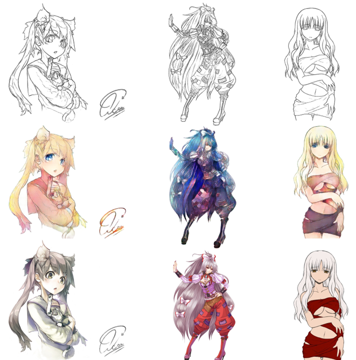
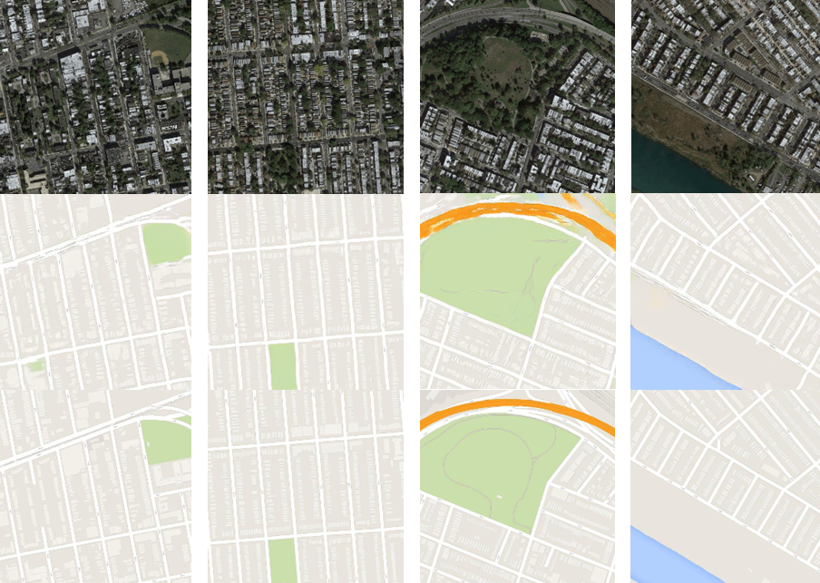

# Pix2Pix
A clean, simple and readable implementation of Pix2Pix in PyTorch. I've tried to replicate the original paper as closely as possible, so if you read the paper the implementation should be pretty much identical. The results from this implementation I would say is on par with the paper, I'll include some examples results below.

## Results
The model was trained on the Maps dataset and for fun I also tried using it to colorize anime.

|1st row: Input / 2nd row: Generated / 3rd row: Target|
|:---:|
||
||


### Maps dataset
The dataset can be downloaded from Kaggle: [link](https://www.kaggle.com/vikramtiwari/pix2pix-dataset).

### Anime dataset
The dataset can be downloaded from Kaggle: [link](https://www.kaggle.com/ktaebum/anime-sketch-colorization-pair).

### Download pretrained weights
Pretrained weights for Satellite image to Google Map [here](https://github.com/aladdinpersson/Machine-Learning-Collection/releases/download/1.0/Pix2Pix_Weights_Satellite_to_Map.zip).

Pretrained weights for Colorizing Anime [here](https://github.com/aladdinpersson/Machine-Learning-Collection/releases/download/1.0/Pix2Pix_Weights_Colorize_Anime.zip).

Extract the zip file and put the pth.tar files in the directory with all the python files. Make sure you put LOAD_MODEL=True in the config.py file.

### Training
Edit the config.py file to match the setup you want to use. Then run train.py

## Pix2Pix paper
### Image-to-Image Translation with Conditional Adversarial Networks by Phillip Isola, Jun-Yan Zhu, Tinghui Zhou, Alexei A. Efros

#### Abstract
We investigate conditional adversarial networks as a general-purpose solution to image-to-image translation problems. These networks not only learn the mapping from input image to output image, but also learn a loss function to train this mapping. This makes it possible to apply the same generic approach to problems that traditionally would require very different loss formulations. We demonstrate that this approach is effective at synthesizing photos from label maps, reconstructing objects from edge maps, and colorizing images, among other tasks. Indeed, since the release of the pix2pix software associated with this paper, a large number of internet users (many of them artists) have posted their own experiments with our system, further demonstrating its wide applicability and ease of adoption without the need for parameter tweaking. As a community, we no longer hand-engineer our mapping functions, and this work suggests we can achieve reasonable results without hand-engineering our loss functions either.
```
@misc{isola2018imagetoimage,
      title={Image-to-Image Translation with Conditional Adversarial Networks}, 
      author={Phillip Isola and Jun-Yan Zhu and Tinghui Zhou and Alexei A. Efros},
      year={2018},
      eprint={1611.07004},
      archivePrefix={arXiv},
      primaryClass={cs.CV}
}
```
