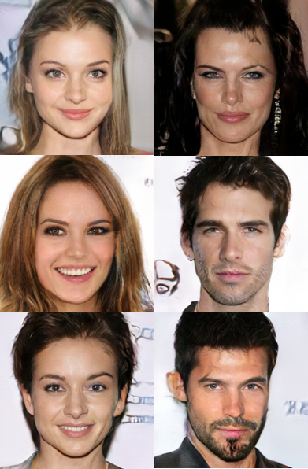

# ProGAN
A clean, simple and readable implementation of ProGAN in PyTorch. I've tried to replicate the original paper as closely as possible, so if you read the paper the implementation should be pretty much identical. The results from this implementation I would say is close to the paper, but I did not train it to 1024x1024 images because I found it took too long. I also did not use number of channels = 512, but instead made the model smaller so that would be something that could worsen the results. I'll include some examples results below.

## Results
||
|:---:|
||
||


### Celeb-HQ dataset
The dataset can be downloaded from Kaggle: [link](https://www.kaggle.com/lamsimon/celebahq).

### Download pretrained weights
Download pretrained weights [here](https://github.com/aladdinpersson/Machine-Learning-Collection/releases/download/1.0/ProGAN_weights.zip).

Extract the zip file and put the pth.tar files in the directory with all the python files. Make sure you put LOAD_MODEL=True in the config.py file.

### Training
Edit the config.py file to match the setup you want to use. Then run train.py

## ProGAN paper
### Progressive Growing of GANs for Improved Quality, Stability, and Variation by Tero Karras, Timo Aila, Samuli Laine, Jaakko Lehtinen

#### Abstract
We investigate conditional adversarial networks as a general-purpose solution to image-to-image translation problems. These networks not only learn the mapping from input image to output image, but also learn a loss function to train this mapping. This makes it possible to apply the same generic approach to problems that traditionally would require very different loss formulations. We demonstrate that this approach is effective at synthesizing photos from label maps, reconstructing objects from edge maps, and colorizing images, among other tasks. Indeed, since the release of the pix2pix software associated with this paper, a large number of internet users (many of them artists) have posted their own experiments with our system, further demonstrating its wide applicability and ease of adoption without the need for parameter tweaking. As a community, we no longer hand-engineer our mapping functions, and this work suggests we can achieve reasonable results without hand-engineering our loss functions either.
```
@misc{karras2018progressive,
      title={Progressive Growing of GANs for Improved Quality, Stability, and Variation}, 
      author={Tero Karras and Timo Aila and Samuli Laine and Jaakko Lehtinen},
      year={2018},
      eprint={1710.10196},
      archivePrefix={arXiv},
      primaryClass={cs.NE}
}
```
